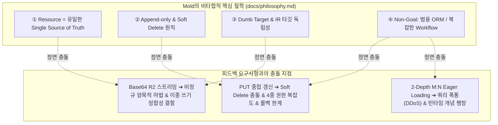

# [Self-Criticism & RFC] drink-log Phase 11 피드백에 대한 철학 충돌 분석 및 자가 비판

> **작성일**: 2026-08-19  
> **참조 문서**: `docs/tasks/2026-08-19-drink-log-feedback-phase-11-evaluation.md`, `docs/philosophy.md`, `AGENTS.md`, `docs/ir-spec.md`  
> **검토 프레임워크**: `/self-criticism-loop` (철학 정합성, 찝찝함/안정성, 성능 및 자원 소모)  
> **핵심 결론**: 프론트엔드/모바일 개발 편의성을 위해 제안된 기능들을 코어에 무비판적으로 수용할 경우, Mold의 핵심 정체성인 "결정적 Resource Runtime"이 훼손되고 "거대하고 불안정한 범용 ORM & 분산 트랜잭션 엔진"으로 변질될 위험이 큼. 각 요구사항별 아키텍처적 경계(Boundary)를 엄격히 설정해야 함.

---

## 1. 개요 및 배경

drink-log 팀은 Phase 11에서 제공된 **`has_many` Eager Loading (`?include=`)**과 **원자적 중첩 생성 (`POST` Nested Writes)**을 실서비스에 대입한 후 긍정적 성과를 확인하였으나, 커스텀 게이트웨이(`functions/api/[[path]].ts`의 One-Shot `/api/entries`)를 완전히 폐기하지 못하는 이유로 다음 3가지 잔여 블로커를 제기하였습니다:

1. **중첩 수정 (`PUT` Nested Update)**: 부모 레코드 수정 시 자식 컬렉션의 일괄 갱신(Replace 또는 Diffing) 지원 요구
2. **Blob 스토리지 생명주기 및 Base64 자동 스트리밍**: JSON Base64 Data URL 자동 R2 스트리밍 및 레코드 삭제 시 R2 이미지 연쇄 삭제(Cascade Cleanup) 요구
3. **M:N 관계 조회 편의성**: 2-Depth 점 체이닝(`?include=record_tags.tag`) 또는 `has_many_through` 선언적 Shortcut 요구

본 문서는 Mold의 핵심 철학(`docs/philosophy.md`, `AGENTS.md`) 및 `/self-criticism-loop` 기준에 입각하여, 이 제안들이 초래할 철학적 충돌과 런타임 안정성 결함을 자가 검증하고 올바른 아키텍처적 대안을 도출합니다.

---

## 2. 핵심 철학 대비 충돌 및 위험 요소 자가 검증

---

### ⚠️ [이슈 1] `PUT /api/{parent}/:id` 중첩 수정 (Nested Update)

#### 1. Mold 철학과의 정면 충돌
* **Append-Only & `soft_delete` 기본값 원칙 파괴**:
  - Mold의 기본 삭제 정책은 `soft_delete: true`입니다 (`AGENTS.md`).
  - 제안된 **Replace Mode (기존 자식 일괄 DELETE 후 신규 INSERT)**를 적용할 경우:
    - Soft Delete를 유지하면 레코드를 수정할 때마다 기존 자식들이 `deleted_at = now`로 계속 마킹되어 DB에 유령 쓰레기 데이터가 기하급수적으로 누적됩니다.
    - 이를 회피하기 위해 자식 레코드만 물리적 `DELETE`를 가한다면 Mold의 "삭제 정책: soft_delete 기본값" 철학을 위반하게 됩니다.
    - 또한 자식 레코드의 고유 ID가 계속 바뀌어, 다른 테이블이나 외부 클라이언트가 해당 자식 ID를 참조하고 있을 경우 외래키 무결성(Referential Integrity)이 완전히 파괴됩니다.
* **범용 ORM(Prisma/Hibernate)화 및 상태 머신 폭발 (Non-Goal 위반)**:
  - ID Diffing 방식을 도입하는 순간 "누락된 항목은 삭제인가 미수정인가?", "부분 수정(PATCH)인가 전체 교체(PUT)인가?"와 같은 변경 추적(Change-tracking) 상태 머신이 필요해집니다. Mold는 범용 ORM이 아닙니다.
* **4중 권한 가드의 결정성 붕괴**:
  - `PUT /api/posts/1` 단 하나의 요청 안에서 `ActionUpdate(부모)`, `ActionDelete(삭제될 자식)`, `ActionCreate(신규 자식)`, `ActionUpdate(기존 자식)` 4가지 권한 평가가 복합적으로 얽혀 보안 모델의 결정성이 흐려집니다.

#### 2. 찝찝함 및 런타임 안정성 검증 (Robustness & Rollback)
* **보상 롤백(Compensating Rollback)의 기술적 한계**:
  - `POST`(신규 생성)는 실패 시 생성된 ID들을 역순으로 `HardDeletePhysically`하면 깨끗이 롤백됩니다.
  - 하지만 `PUT`은 **"이미 수정/삭제된 기존 데이터를 이전 상태로 완벽히 복원"**해야 합니다. `storage.Store`가 단순 CRUD 인터페이스인 구조에서 분산 트랜잭션 로그 없이 이를 안전하게 복구하는 것은 불가능하며, 부분 실패 시 DB 데이터가 오염(Dangling/Corrupted state)됩니다.

---

### ⚠️ [이슈 2] `type: blob` Base64 자동 R2 스트리밍 & 삭제 훅

#### 1. Mold 철학과의 정면 충돌
* **Dumb Target & IR 타깃 독립성 위반 (철학 ④, ⑤)**:
  - IR은 특정 인프라(Cloudflare R2, AWS S3 등)의 세부 구현에 종속되지 않는 순수 명세여야 합니다.
  - JSON Body의 문자열이 `data:image/...;base64`로 시작한다는 이유로 런타임이 이를 가로채 R2 버킷에 업로드하고 DB 컬럼 값을 키로 바꿔치기하는 것은 **"명세를 이행하는 결정론적 컴파일러"**가 아니라 **"비정규적 암묵적 마법(Implicit Magic)"**입니다.
* **기존 공식 스펙과의 불일치 및 자원 낭비**:
  - Mold는 이미 `docs/ir-spec.md` 5.5절에서 표준 규격으로 **1-Step `multipart/form-data`** 및 **2-Step Upload 엔드포인트**를 정의했습니다.
  - Base64 JSON 페이로드는 33%의 네트워크 대역폭 팽창과 Worker 메모리 버퍼링 낭비를 유발하며, Cloudflare D1/SQLite의 단일 쿼리 바인딩 크기(1MB)를 위태롭게 만듭니다.

#### 2. 찝찝함 및 성능/자원 소모 검증 (Performance & Dual-Write)
* **이중 쓰기/삭제(Dual-Write/Delete)의 비원자성**:
  - R2 `bucket.put` 성공 후 DB 트랜잭션이 실패하면 R2에 영구 고아(Orphan) 파일이 남습니다.
  - 반대로 레코드 삭제 시 DB 커밋 후 R2 `bucket.delete`가 네트워크 오류로 실패하면 스토리지 누수가 발생합니다.
* **Soft Delete와의 정책적 모순**:
  - DB 행이 `deleted_at`으로 소프트 딜리트되었을 때 R2의 원본 파일을 물리적으로 즉시 삭제해 버리면, 실수로 삭제된 레코드를 복구(Restore)할 수 없어 Soft Delete의 존재 이유가 무색해집니다.

---

### ⚠️ [이슈 3] M:N 관계 2-Depth Eager Loading (`?include=record_tags.tag`)

#### 1. Mold 철학과의 정면 충돌
* **"런타임의 개념을 늘리지 않는다" 및 마세라티 원칙 위반**:
  - `has_many_through`나 `many_to_many shortcut`을 IR에 추가하는 순간, IR 스펙, DDL 생성기, D1 쿼리 컴파일러, 권한 검사기, View 렌더러 전체에 엄청난 수평적 복잡도가 추가됩니다.
* **DDoS 및 쿼리 폭풍(Query Bomb) 위험**:
  - Phase 11에서 2-depth 체이닝을 `400 INVALID_INCLUDE`로 엄격히 차단한 이유는, 임의의 깊이 조인으로 인한 N+1 쿼리 폭풍과 Cloudflare D1 서브쿼리 한도 초과를 원천 방어하기 위함이었습니다.
* **조인 경로별 권한 평가(ACL Cascade)의 모호성**:
  - 부모(`SakeRecord`) 권한은 있으나 중간 조인 테이블(`RecordTag`) 또는 최종 타깃(`Tag`)에 대한 읽기 권한이 없는 경우, 어떤 단위로 에러를 내거나 필터링할지에 대한 결정론적 규칙이 모호해집니다.

---

## 3. 철학을 수호하는 실용적 대안 (Pragmatic Guidelines)

피드백의 고통(Friction)은 해소하되 Mold의 철학을 훼손하지 않는 합의점과 책임 경계는 다음과 같습니다:

| 요구사항 | 나쁜 접근 (철학 위반 / 과도한 마법) | **Mold다운 올바른 접근 (철학 준수 & 명시성)** |
| :--- | :--- | :--- |
| **중첩 수정 (`PUT`)** | 복잡한 Diffing 엔진 & 무분별한 Replace (Hard Delete 유발) | **명시적 자식 엔드포인트 CRUD 활용** 또는 **부모-자식 관계가 1:N 종속 엔티티(Weak Entity)일 때만 ID 명시 기반의 제한적 업데이트** |
| **Blob 스토리지** | JSON Base64 감지 마법 & 비원자적 R2 인라인 결합 | **1-Step `multipart/form-data` 표준 준수** & 비동기 고아 파일 정리(Reconciliation GC Worker)로 스토리지 생명주기 분리 |
| **M:N 관계 조회** | 2-Depth 임의 체이닝 허용 (`a.b.c`) | **1-Depth 병렬 조회 허용 (`?include=record_tags`) + 클라이언트 태그 마스터 캐싱** |

---

## 4. 향후 로드맵 제안

1. **단기 (Phase 12 후보)**:
   - `PUT /api/{parent}/:id`에서 자식 관계 배열 수신 시의 명확한 정책(ID가 명시된 자식의 Update vs 신규 자식 Create의 사전 검증 범위) 수립. 단, 무조건적 자식 전체 삭제(Replace Mode)는 배제.
   - 1-Step `multipart/form-data` 기반 파일 업로드의 모바일/웹 클라이언트 SDK 사용 가이드 제공 (Base64 JSON 탈피).
2. **중장기**:
   - R2/S3 스토리지 오브젝트와 D1 DB 레코드 간의 정합성을 주기적으로 맞추는 비동기 배치(Reconciliation Tooling)를 어댑터 레벨에서 제공.
