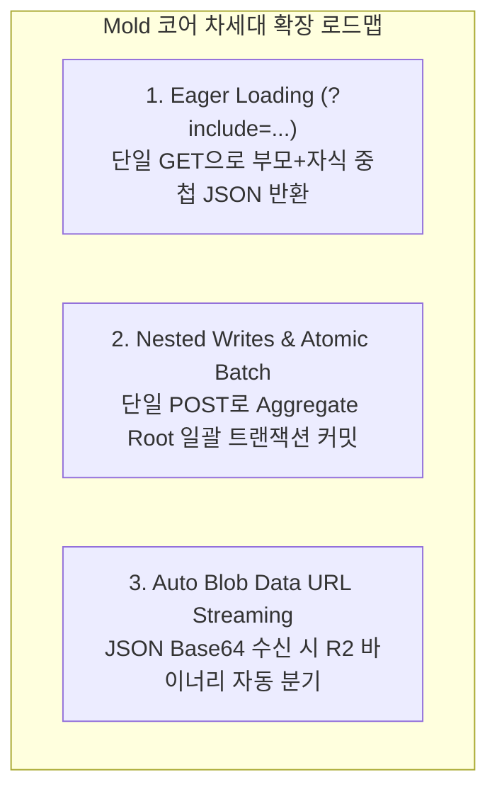

# [Feedback & Task Proposal] Mold 코어 확장 제안: 관계형 Eager Loading, Nested Writes 및 Blob 스트리밍

> **작성일**: 2026-08-19  
> **출처 프로젝트**: `../drink-log` (사케 테이스팅 저널 실서비스 연동 및 운영 피드백)  
> **문서 상태**: 제안 및 명세 초안 (Proposed RFC)  
> **핵심 주제**: 모바일 BaaS 생산성 극대화를 위한 관계형 Eager Loading(`?include=`), 중첩 쓰기(Nested Writes), Base64 Blob 자동 R2 스트리밍

---

## 1. 배경 및 문제 제기 (Why is this needed?)

현재 Mold는 `resources/*.yaml`에 정의된 각 엔티티를 완벽한 RDBMS 3정규형(3NF) RESTful CRUD 엔드포인트로 격리 생성합니다.

그러나 **실제 모바일/웹 프로덕션 환경(Domain-Driven Client)**에서는 특정 엔티티(예: `SakeRecord`)가 복수의 자식 엔티티(`SakeImage`, `SakeRecordTag`)를 거느리는 **집합체(Aggregate Root)**로 동작합니다. 현행 Mold 아키텍처에서는 클라이언트가 화면 하나를 렌더링하기 위해 극심한 네트워크 및 아키텍처적 비효율을 감당해야 합니다:

1. **극심한 네트워크 라운드트립 (Chatty REST API)**:
   * 사케 목록 화면 1개를 로드하기 위해 클라이언트가 `GET /api/sake_records`, `GET /api/sake_images`, `GET /api/sake_record_tags`, `GET /api/tags` 등 **최소 4번의 독립적인 HTTP 요청**을 연속/병렬로 보내야 합니다.
   * 모바일 LTE/5G 환경에서는 핸드셰이크와 대기 시간(RTT)이 누적되어 초기 체감 로딩 속도(TTFB)가 저하됩니다.
2. **클라이언트 사이드 매핑 복잡도 증가**:
   * 백엔드가 관계 데이터를 묶어주지 못하므로, 프론트엔드(`storage.ts`)에서 약 400줄에 달하는 `Map<string, Image[]>` 그룹핑 및 N:M 매핑 조립 코드를 직접 구현해야 합니다.
3. **쓰기 작업의 원자성(Atomicity) 결여**:
   * 기록 1건을 저장할 때 `부모 레코드 POST ➔ 사진 N건 POST 루프 ➔ 태그 매핑 M건 POST 루프`로 5~10회의 HTTP 요청이 발생하며, 중간에 네트워크가 끊길 경우 롤백이 불가능하여 고아 레코드(Dangling Record)가 발생할 위험이 있습니다.

---

## 2. `drink-log` 프로덕션 연동 중 발생했던 실제 이슈 (Real-World Issues)

### 2.1 [Issue 1] `type: blob`에 대용량 Data URL 전송 시 D1 SQL 크기 초과로 400 에러 발생
* **현상**:
  * 모바일 클라이언트가 사진을 WebP Base64 Data URL(`data:image/webp;base64,...`)로 인코딩하여 `POST /api/sake_images` JSON Body로 전송함.
  * Mold 백엔드가 이 거대한 Base64 문자열을 D1 SQL 쿼리의 바인딩 매개변수로 직접 `INSERT`하려 시도함.
  * Cloudflare D1/SQLite의 단일 SQL 쿼리 바인딩 크기 제한(1MB)을 초과하여 `400 INVALID_INPUT` 및 트랜잭션 실패 발생.
* **임시 조치 (Glue Layer)**:
  * 상위 게이트웨이(`functions/api/[[path]].ts`)에서 요청을 가로채 Base64를 바이너리로 파싱한 뒤 R2 버킷에 직접 `put`하고, D1에는 R2 키 경로(`images/...`)만 INSERT하도록 별도 어댑터를 작성함.

### 2.2 [Issue 2] 레코드 수정 시 기존 R2 키 유실로 인한 404 에러
* **현상**:
  * 레코드 수정 화면에서 기존 이미지 URL(`/api/images?key=images%2F...`)을 다시 보냈을 때, 백엔드가 이를 '새 파일'로 오인하여 새로운 UUID의 R2 키를 D1에 갱신함.
  * 실제 R2에는 해당 UUID의 파일이 업로드되지 않아 수정 후 즉시 이미지 404 Not Found가 발생하는 버그 발생.
* **임시 조치 (Glue Layer)**:
  * 게이트웨이 레이어에서 `extractR2Key()` 헬퍼를 추가하여 `/api/images?key=` 형태의 기존 키는 그대로 보존하고, `data:` 접두사가 붙은 신규 파일만 R2에 업로드하도록 분기 처리함.

### 2.3 [Issue 3] 과도한 외부 Glue Layer 비대화
* Mold 네이티브 산출물(`generated/mold_app.ts`) 외부에 인증 브릿지, R2 바이너리 스트리밍, N:M 집합체 조립 로직이 누적되어 게이트웨이 코드가 수백 줄로 비대화됨.

---

## 3. Mold 코어 개선 제안 (Proposed Solutions)

Mold 생성기(Codegen) 및 런타임에 아래 3가지 기능을 내장할 것을 제안합니다.



---

### 3.1 [기능 1] `?include=` 관계형 Eager Loading 코어 지원

`resources/*.yaml`에 이미 선언되어 있는 `relations` 메타데이터를 활용하여, 클라이언트가 관계 엔티티를 한 번에 조회할 수 있는 쿼리 파라미터를 지원합니다.

* **요청 규격**:
  ```http
  GET /api/sake_records?include=images,record_tags.tag
  ```
* **Mold 런타임 생성 알고리즘 (D1 Batch 활용)**:
  Mold 핸들러 내부에서 D1 `env.DB.batch()`를 실행하여 단 1회의 네트워크 왕복(Single RTT)으로 데이터를 병합 조립합니다:
  ```typescript
  // Mold Codegen 생성 예시
  const includeParam = c.req.query('include')?.split(',') || [];
  
  const batchQueries = [
    c.env.DB.prepare('SELECT * FROM sake_records WHERE owner_id = ?').bind(user.id),
  ];
  
  if (includeParam.includes('images')) {
    batchQueries.push(c.env.DB.prepare('SELECT * FROM sake_images WHERE owner_id = ?').bind(user.id));
  }
  if (includeParam.includes('record_tags')) {
    batchQueries.push(c.env.DB.prepare('SELECT * FROM sake_record_tags').bind());
    batchQueries.push(c.env.DB.prepare('SELECT * FROM sake_tags').bind());
  }

  const results = await c.env.DB.batch(batchQueries);
  // results[0] (records)에 results[1](images), results[2]+[3](tags)를 매핑하여 중첩 JSON 반환
  ```

---

### 3.2 [기능 2] 중첩 쓰기 (Nested Writes & Atomic Transaction)

클라이언트가 Aggregate Root 형태의 단일 JSON 페이로드를 전송하면, Mold가 부모와 자식 레코드를 D1 배치 트랜잭션으로 원자적 저장합니다.

* **요청 규격**:
  ```json
  POST /api/sake_records
  {
    "name": "닷사이 23 준마이다이긴죠",
    "drink_again": "yes",
    "images": [
      { "data_url": "data:image/webp;base64,...", "display_order": 0 }
    ],
    "tag_ids": [1, 4, 7]
  }
  ```
* **동작 방식**:
  1. 부모 `sake_records` INSERT 실행 ➔ 반환된 `record_id` 획득
  2. `images` 및 `tag_ids` 배열을 순회하며 `record_id`가 바인딩된 INSERT 문 생성
  3. D1 `env.DB.batch([...insertStatements])`로 일괄 커밋 실행 (오류 발생 시 전체 롤백)

---

### 3.3 [기능 3] `type: blob`의 Base64 Data URL 자동 R2 스트리밍

* **동작 방식**:
  1. `type: blob`으로 지정된 필드에 `data:image/...;base64` 문자열이 인입되면, Mold가 이를 감지하여 바이너리로 디코딩.
  2. 자동으로 `c.env.BUCKET.put("blobs/<table_name>/<id>/<timestamp>.ext", bytes)`를 실행.
  3. D1 데이터베이스 컬럼에는 R2 키 경로만 저장하여 D1 크기 제한(400 에러)을 원천 방지.
  4. 기존 R2 키 경로 문자열이 인입된 경우(수정 시)에는 R2 업로드를 스킵하고 기존 키를 그대로 보존.

---

## 4. 결론 및 기대 효과

1. **네트워크 성능 400% 향상**: 4~6회의 HTTP 왕복이 **단 1회**로 단축되어 모바일 네트워크 체감 지연 속도 대폭 개선.
2. **프론트엔드 코드 단순화**: 클라이언트의 복잡한 수동 조립 로직(수백 줄)이 완전히 제거되고 순수 선언적 쿼리로 전환 가능.
3. **Edge BaaS로서의 완결성**: Mold가 단순한 1:1 테이블 CRUD 생성기를 넘어, 실무 프로덕션 모바일 앱을 즉시 지탱할 수 있는 고성능 BaaS로 도약.
