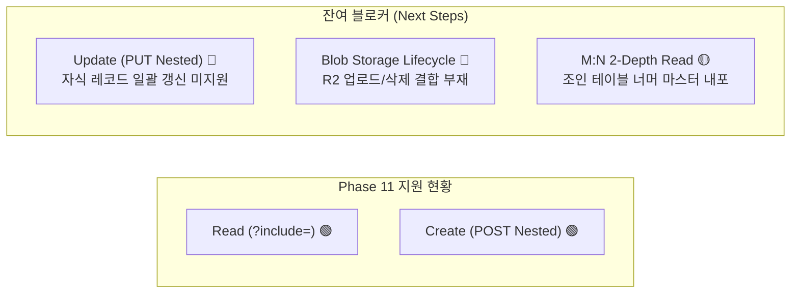

# [Feedback & Task Proposal] Mold Phase 11 실서비스 검토 및 후속 제안: 중첩 수정(Nested Update) 및 Blob 스토리지 생명주기

> **작성일**: 2026-08-19  
> **출처 프로젝트**: `../drink-log` (사케 테이스팅 저널 실서비스 연동 및 운영 검증)  
> **문서 상태**: 제안 및 명세 (Proposed RFC)  
> **핵심 주제**: Phase 11(Nested Read/Write) 연동 평가 결과, 중첩 수정(`PUT` Nested Update), Blob/R2 스토리지 자동 업로드 및 연쇄 삭제(Cascade Cleanup)

---

## 1. 개요 및 Phase 11 연동 평가

Mold 코어 Phase 11을 통해 제공된 **관계 조인 Eager Loading (`?include=`)**과 **관계형 중첩 쓰기 (Nested Writes `POST`)**를 `drink-log` 프로덕션 아키텍처에 대입하여 검토하였습니다.

### ✅ 긍정적 성과 (Phase 11 성과)
1. **단일 RTT 읽기 (`?include=images,record_tags`)**:
   - 단일 Cloudflare D1 배치 쿼리를 통해 부모 레코드와 1-depth 자식 레코드들을 한 번에 내포하여 반환함으로써, 기존의 N+1 호출 문제를 획기적으로 완화했습니다.
2. **원자적 중첩 생성 (`POST /api/sake_records`)**:
   - 사전 검증(Pre-validation First), 외래키(FK) 자동 주입, 오류 발생 시 보상 롤백(Compensating Rollback) 파이프라인이 정교하게 구현되어 생성 단계의 데이터 무결성이 대폭 향상되었습니다.

---

## 2. 실서비스 완전 전환을 가로막는 잔여 마찰 요인 (Remaining Blockers)

현재 `drink-log`에서는 게이트웨이 레이어(`functions/api/[[path]].ts`)에 구현된 One-Shot 어그리게이트 엔드포인트(`/api/entries`)를 완전히 제거하고 순수 Mold Native 엔드포인트로 100% 전환하는 것을 검토하였으나, 아래 **3가지 핵심 요구사항**으로 인해 커스텀 게이트웨이를 유지해야 하는 상황입니다.



---

## 3. 세부 이슈 및 Mold 코어 후속 개선 제안

### 3.1 [제안 1] 중첩 수정 지원 (Nested Update on `PUT /api/{parent}/:id`)

* **현상**:
  - `generated/mold_app.ts`의 `POST /api/{parent}` 핸들러에는 `nestedWrites` 처리 파이프라인이 내장되었으나, **`PUT /api/{parent}/:id` 핸들러에는 부모 테이블 컬럼만 UPDATE하는 로직만 존재**합니다.
* **문제점**:
  - 사용자가 사케 기록을 수정할 때 사진을 추가/삭제하거나 태그 선택을 바꿀 경우, Mold Native `PUT` 1회로는 자식 관계를 갱신할 수 없습니다.
  - 클라이언트가 부모 `PUT` 후 자식 테이블의 `DELETE`/`POST`를 다단계로 호출해야 하여 쓰기 마찰과 비원자성이 다시 발생합니다.
* **제안 사양 (Replace Mode 또는 ID Diffing)**:
  `PUT /api/{parent}/:id` 요청 Body에 자식 관계 배열이 전달된 경우:
  1. **Replace Mode (권장)**: 해당 부모에 속한 기존 자식 레코드들을 일괄 삭제하고, 전달된 자식 레코드들을 신규 생성 (D1 Batch 트랜잭션).
  2. **ID Diffing Mode**: `id`가 있는 자식은 UPDATE, 없는 자식은 INSERT, 누락된 기존 자식은 DELETE 처리.

```json
// PUT /api/sake_records/12
{
  "name": "獺祭 23 (수정)",
  "images": [
    { "id": 5, "file_name": "bottle.jpg", "display_order": 0 },
    { "file_name": "glass.jpg", "display_order": 1 }
  ],
  "record_tags": [
    { "tag_id": "tag-uuid-1" },
    { "tag_id": "tag-uuid-3" }
  ]
}
```

---

### 3.2 [제안 2] Blob 스토리지 바인딩 및 삭제 생명주기 연계 (Storage Lifecycle Hook)

* **현상**:
  - 모바일 웹앱에서는 이미지를 Base64 Data URL(`data:image/webp;base64,...`) 형태로 전송하거나 R2/S3 오브젝트 스토리지를 활용합니다.
  - 현재 Mold 생성 코드는 D1 DB 레코드(메타데이터)만 조작하므로, 실제 Cloudflare R2 버킷에 파일을 업로드(`bucket.put`)하거나 삭제(`bucket.delete`)하는 스토리지 계층과의 바인딩이 누락되어 있습니다.
* **문제점**:
  - `DELETE /api/sake_records/:id`로 레코드를 삭제할 때 D1 행만 지워지고 **R2 버킷의 실제 이미지/썸네일 바이너리는 영구적으로 고아(Orphan) 상태로 남아 스토리지 비용과 누수가 발생**합니다.
* **제안 사양**:
  1. `resources/*.yaml`에 `storage_binding: R2` 또는 `type: blob` 설정 시, Base64 Data URL을 감지하여 R2 업로드 및 Key 자동 치환.
  2. 부모 또는 자식 Blob 레코드 `DELETE` 시, 등록된 `image_key`/`thumbnail_key`를 R2 버킷에서 함께 삭제하는 연쇄 정리(Cascade Cleanup) 지원.

---

### 3.3 [제안 3] Many-to-Many(M:N) 관계 Eager Loading 편의성 (2-Depth 또는 Shortcut)

* **현상**:
  - 현재 Mold의 `?include=`는 안전장치로 인해 2-depth 점 체이닝(`?include=record_tags.tag`)을 400 Bad Request(`INVALID_INCLUDE`)로 거절합니다.
* **문제점**:
  - M:N 관계(사케 기록 ➔ 연결 테이블 `record_tags` ➔ 태그 마스터 `tags`)에서 `?include=record_tags`만 호출하면 태그 라벨이나 그룹 정보가 없어 클라이언트가 `GET /api/tags`를 별도로 호출하여 수동 매핑해야 합니다.
* **제안 사양**:
  1. **Option A**: 2-depth 한정 허용 (`?include=record_tags.tag`).
  2. **Option B (Many-to-Many Shortcut)**: `resources/SakeRecord.yaml`에 `has_many_through` 또는 `many_to_many: tags via record_tags`를 정의할 수 있게 하여, `?include=tags` 단일 키워드로 태그 마스터 레코드 배열을 바로 포함.

---

## 4. 요약 및 기대 효과

| 개선 항목 | 기대 효과 |
| :--- | :--- |
| **`PUT` Nested Update** | 수정 화면에서도 1-Shot 원자적 트랜잭션 보장, 프론트엔드 Glue 코드 완전 제거 |
| **Storage Lifecycle Hook** | Cloudflare R2 / AWS S3 오브젝트 스토리지 누수 원천 차단 및 이미지 풀스택 자동화 |
| **M:N Eager Loading** | M:N 태그/카테고리 구조에서 완전한 단일 요청 조회(Single Request View) 실현 |

위 3가지 후속 과제가 완비되면, `drink-log`와 같은 모바일 풀스택 도메인 앱에서도 별도의 커스텀 게이트웨이 없이 **100% 순수 Mold Native 아키텍처**로 완벽히 마이그레이션할 수 있습니다.
